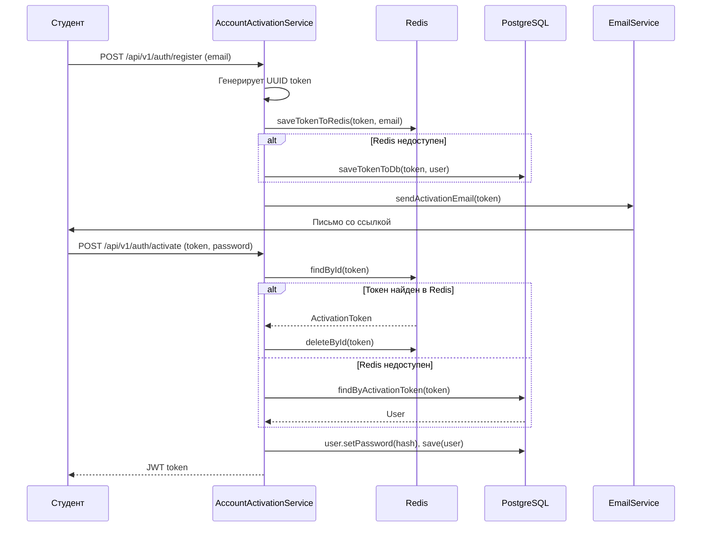

# 🎓 CampusLoyalty — Платформа мотивации студентов

Закрытая B2B2C-платформа для управления внутренней валютой и мерчем в университете. Деканат и кураторы геймифицируют учебный процесс, начисляя валюту за активности. Студенты тратят её на эксклюзивный мерч (общий и факультетский).

> **Цель проекта:** демонстрация навыков проектирования RBAC, кастомных сценариев безопасности, отказоустойчивых хранилищ и изоляции данных на стеке Spring Boot.

---

## 💼 Бизнес-логика

### 👥 Ролевая модель (RBAC)

| Роль | Права | Видимость |
|------|-------|-----------|
| **DIRECTOR** | Полный доступ, управление кураторами | Всё |
| **CURATOR** | Создание квестов, назначение старост, управление факультетом | Свой факультет |
| **STAROSTA** | Помощник куратора, начисление баллов | Своя группа |
| **STUDENT** | Участие в квестах, покупка мерча | Только доступные квесты |

### 🎓 Жизненный цикл студента

Пользователи не регистрируются сами — их добавляет деканат при зачислении. Статус отражает положение студента в университете:

- **ACTIVE** — зачислен, полный доступ
- **ACADEMIC_LEAVE** — в академе, ограниченный доступ
- **DISMISSED** — отчислен, доступ заблокирован
- **GRADUATED** — выпускник, ограниченный доступ

### 🏷️ Изоляция данных

- **Общие квесты/мерч** (от декана) — видны всем
- **Факультетские квесты/мерч** (от куратора) — видны только студентам этого факультета

---

## 🔐 Архитектура безопасности

### Компоненты

| Компонент | Назначение |
|-----------|-----------|
| **SecurityConfig** | Настройка цепочки фильтров, отключение CSRF, подключение JWT-фильтра |
| **JwtUtils** | Генерация, валидация и парсинг JWT (HS256) |
| **JwtAuthenticationFilter** | Перехватчик запросов: извлекает JWT, валидирует, загружает пользователя |
| **AccountActivationService** | Онбординг: генерация токенов, установка первого пароля |
| **EmailService** | Отправка писем со ссылкой для установки пароля |
| **AppUserDetails** | Обертка над User для Spring Security |
| **UserDetailsServiceImpl** | Загрузка пользователя по email или ID |

### Flow онбординга (первый вход)

